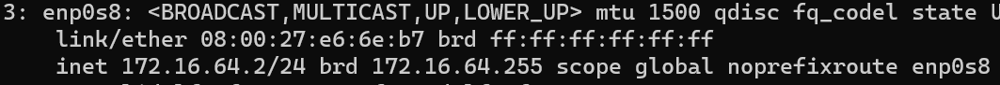
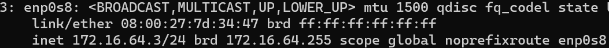

🎯 Quels sont les deux différents types d'hyperviseur existant, et quelles sont leur différence ? 

Les deux types d'hyperviseur sont le niveau 1 Bare metal qui est plus performant, secur et rapide et le niveau 2 est plus simple à manier et donc il est plus simple pour des tests.

⏹️ associez-leur les adresses IP 172.16.64.2 et 172.16.64.3





🎰 Changez le nom d'hôte des machines pour avoir respectivement vm-landing1 et vm-landing2

```
[root@localhost ~]# cat /etc/hostname
vm-landing1

[root@localhost ~]# cat /etc/hostname
vm-landing2
```

🎰 Trouvez l'adresse IP locale des machines

```
3: enp0s8: <BROADCAST,MULTICAST,UP,LOWER_UP> mtu 1500 qdisc fq_codel state UP group default qlen 1000
    inet 172.16.64.3/24 brd 172.16.64.255 scope global noprefixroute enp0s8

3: enp0s8: <BROADCAST,MULTICAST,UP,LOWER_UP> mtu 1500 qdisc fq_codel state UP group default qlen 1000
    inet 172.16.64.2/24
```

🎯 Quelle est l'adresse de broadcast ?

l'adresse de broadcast est 172.16.64.255 pour les deux machines virtuels.

🎰 Trouvez le masque de sous-réseau des machines

```
3: enp0s8: <BROADCAST,MULTICAST,UP,LOWER_UP> mtu 1500 qdisc fq_codel state UP group default qlen 1000

    inet /24

3: enp0s8: <BROADCAST,MULTICAST,UP,LOWER_UP> mtu 1500 qdisc fq_codel state UP group default qlen 1000

    inet /24
```

🎰 Trouvez l'adresse MAC des machines

```
3: enp0s8: <BROADCAST,MULTICAST,UP,LOWER_UP> mtu 1500 qdisc fq_codel state UP group default qlen 1000

    link/ether 08:00:27:7d:34:47 brd ff:ff:ff:ff:ff:ff

3: enp0s8: <BROADCAST,MULTICAST,UP,LOWER_UP> mtu 1500 qdisc fq_codel state UP group default qlen 1000

    link/ether 08:00:27:e6:6e:b7 brd ff:ff:ff:ff:ff:ff
```

🎰 Pingez l'adresse publique du site www.ynov.com avec une des deux machines


```
[root@localhost ~]# ping www.ynov.com
PING www.ynov.com (104.26.10.233) 56(84) bytes of data.
64 bytes from 104.26.10.233 (104.26.10.233): icmp_seq=1 ttl=56 time=19.5 ms

--- www.ynov.com ping statistics ---
3 packets transmitted, 3 received, 0% packet loss, time 10121ms
rtt min/avg/max/mdev = 18.331/18.940/19.498/0.477 ms
```

🎰 Essayez de lire le contenu du fichier /var/log/tallylog

```
[labo-user1@vm-landing2 ~]$ cat /var/log/tallylog
cat: /var/log/tallylog: Permission denied
```


🎯 Que se passe-t-il ? Pourquoi ?


la lecture du dossier nous est refusé car le nouvel utilisateur n'a pas les permissions requisent


🎯Ajoutez ces utilisateurs au groupe wheel et retentez. Il y aura toujours une erreur. Après avoir recherche sur Google la significance du groupe wheel dans Linux, pourquoi cette erreur est-elle toujours présente ?


parce que le groupe wheel n'a pas les permissions requise non-plus.


🎯 Retentez avec la commande sudo cat Il n'y aura plus d'erreur. Pourquoi ?


il y a une erreur car l'utilisateur labo-user1 n'a pas le droit d'utiliser sudo.


🎯Retentez en changeant d'utilisateur et en passant root. Ca devrait marcher. Pourquoi ?


car root est l'administrateur et il a tout les droits.


🎯Ajoutez l'utilisateur labo-user1 au sudoers (petit coup de Google), puis retentez la commande sudo cat. Ca devrait marcher. Pourquoi ?


car en ajoutant labo-user1 au sudoers on lui donne le droit d'utiliser sudo avant une commande.


🎰 Pingez vm-landing2 avec vm-landing1

```
[labo-user2@vm-landing2 /]$ ping 172.16.64.3
PING 172.16.64.3 (172.16.64.3) 56(84) bytes of data.
64 bytes from 172.16.64.3: icmp_seq=1 ttl=64 time=1.46 ms

--- 172.16.64.3 ping statistics ---
3 packets transmitted, 3 received, 0% packet loss, time 2004ms
rtt min/avg/max/mdev = 0.501/0.872/1.456/0.417 ms
```

🎰 Vérifiez leur version

```
[labo-user2@vm-landing2 /]$ sudo dnsmasq --version
Dnsmasq version 2.85
```

Changez le DNS pour celui de CloudFlare puis 🎰 pingez google.com

```
[labo-user2@vm-landing2 /]$ ping google.com
PING google.com (172.217.20.174) 56(84) bytes of data.
64 bytes from waw02s07-in-f14.1e100.net (172.217.20.174): icmp_seq=1 ttl=115 time=30.4 ms

--- google.com ping statistics ---
3 packets transmitted, 3 received, 0% packet loss, time 10112ms
rtt min/avg/max/mdev = 28.777/32.081/37.098/3.606 ms
```

🎰 Vérifiez leur version

```
[root@vm-landing1 ~]# unzip --version
UnZip 6.00

[root@vm-landing1 ~]# fail2ban-client --version
Fail2Ban v1.0.2
```

Changez le DNS pour celui de Google puis 🎰 pingez cloudflare.com

```
[root@vm-landing1 ~]# ping cloudflare.com
PING cloudflare.com (104.16.133.229) 56(84) bytes of data.
64 bytes from 104.16.133.229 (104.16.133.229): icmp_seq=1 ttl=56 time=19.8 ms

--- cloudflare.com ping statistics ---
2 packets transmitted, 2 received, 0% packet loss, time 5068ms
rtt min/avg/max/mdev = 19.813/19.908/20.003/0.095 ms
```

🎰 Trouvez et affichez la route par défaut présente sur la machine

```
[root@vm-landing1 ~]# ip route
default via 10.0.2.2 dev enp0s3 proto dhcp src 10.0.2.15 metric 100
```

Sur la machine landing-vm1, changez la carte réseau en Host-Only.
🎯 Quelle est l'utilité de ce type de carte réseau ?

les cartes host only sont utiles dans des environnement isolé ou les machines virtuelles n'ont pas besoin de comuniquer avec d'autres environnements.

🎰 Pingez landing-vm2 avec landing-vm1, que se passe-t-il ?

```
[labo-user2@vm-landing2 /]$ ping 172.16.64.3
PING 172.16.64.3 (172.16.64.3) 56(84) bytes of data.
64 bytes from 172.16.64.3: icmp_seq=1 ttl=64 time=1.34 ms

--- 172.16.64.3 ping statistics ---
3 packets transmitted, 3 received, 0% packet loss, time 2004ms
rtt min/avg/max/mdev = 0.402/0.738/1.336/0.423 ms
```

le ping réussi.